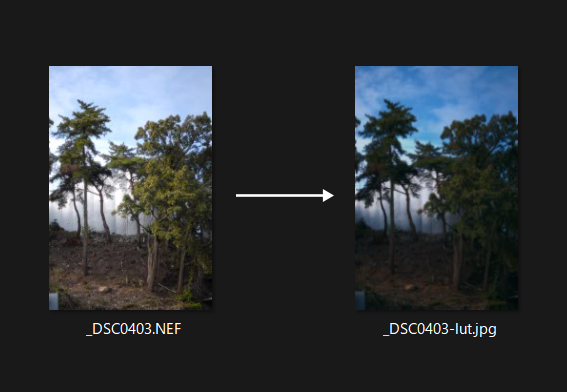

# RAW2jpg_3DLUT

RAWに3DLUTを当てて現像できるPythonとバッチです。 
バッチのパスを変更して使ってください。  
  コードにはNEF DNG CR3 RAF ARWしか書いてませんが [rawpy](https://github.com/letmaik/rawpy) を使ってるのでだいたいいける筈です。
  
必要なライブラリは以下。
```
pip install rawpy opencv-python pillow pillow-lut numpy
```

    

